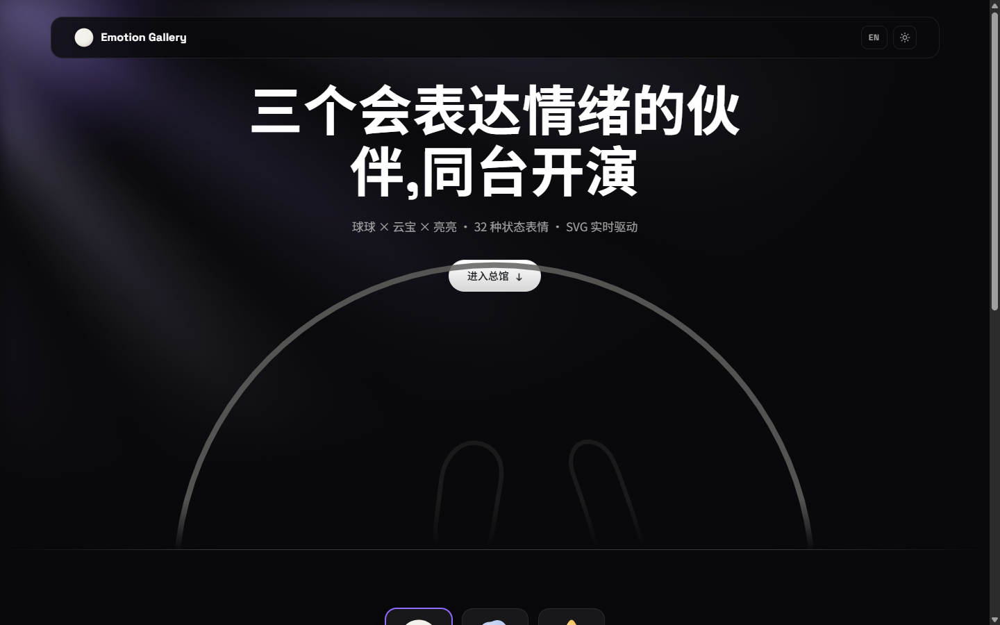
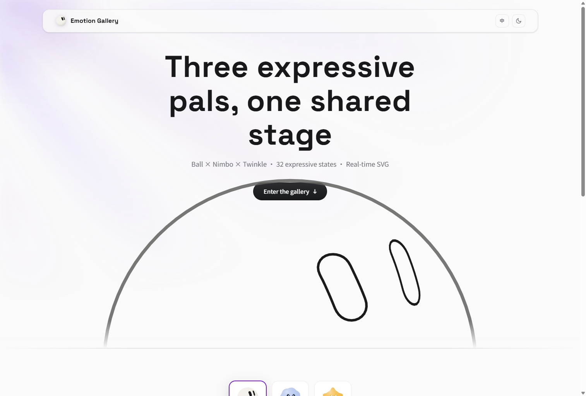
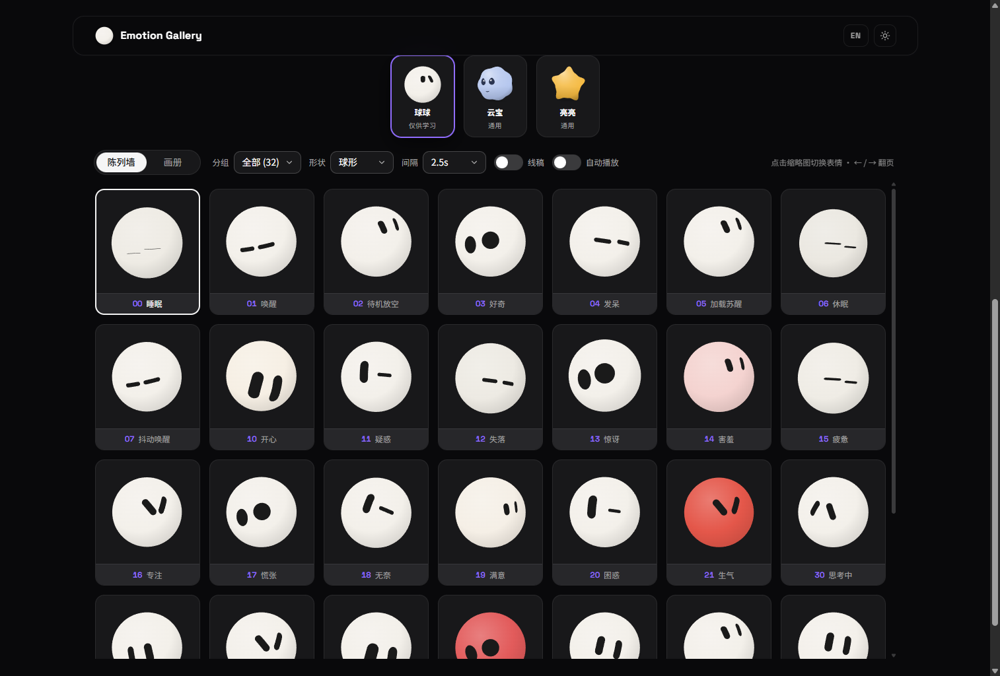
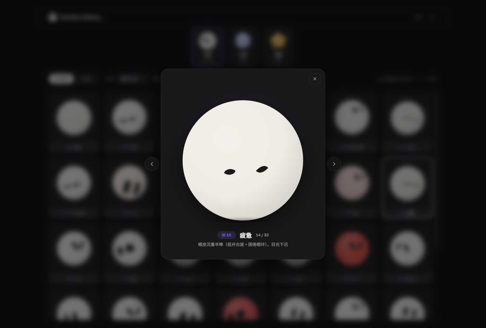
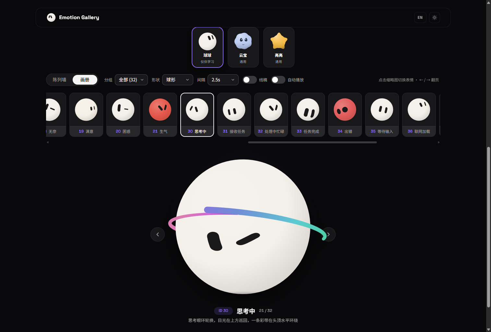

<div align="center">

# Emotion Ball 表情馆

**为 AI 助手打造的表情引擎 —— 32 种状态表情 · 3 种身体形态 · 纯 SVG + 原生 JavaScript · 零依赖**

[](https://emotion-balls.vercel.app/)
[](LICENSE)
[](#)
[](#)

**中文** | [English](README.en.md)

[在线预览](https://emotion-balls.vercel.app/) · [特性](#特性) · [快速开始](#快速开始) · [集成指南](#集成指南) · [自定义与扩展](#自定义与扩展) · [许可](#许可)

</div>

---

> **授权声明**:仓库内 [emotion-ball/](emotion-ball/) 目录的球形角色(blob / wedge / gem)仅供个人技术学习与研究,**禁止任何商业用途**,详见 [NOTICE.md](NOTICE.md) 与 [LICENSE](LICENSE)。
>
> [mood-mates/](mood-mates/) 目录为同源引擎的**原创角色子项目**(云宝 Nimbo / 亮亮 Twinkle),独立原创设计,采用**双许可**(个人学习免费 + 可获取商业授权),不受上述限制约束。

本仓库由「一座总馆 + 两个子项目」组成:

- **总馆(根目录 `index.html`)**:云宝 × 亮亮 × 球球 三个角色**同台切换展示**——同一面 32 表情陈列墙,点击顶部角色卡即可整馆换角,由两套引擎(MoodMates + EmotionBall)共同驱动;
- **[mood-mates/](mood-mates/)**:原创角色项目(云宝 / 亮亮),多角色架构、双许可、可商用,自带独立展示站与集成文档;
- **[emotion-ball/](emotion-ball/)**:球形角色学习项目,32 种状态表情、3 种身体形态,自带独立展示站。

Emotion Ball 是一套面向 AI 助手的表情引擎:32 种状态表情全部由纯 SVG 与原生 JavaScript 实时驱动,零框架、零图片资源。AI 侧只需输出一个 `emotionId`,即可切换到对应表情,可直接用作聊天机器人、桌面宠物、悬浮助手的情绪表达层。

它也不只是"一颗球":内置圆胖(blob)、三角(wedge)、菱形(gem)三种身体形态,支持主题色多实例与线稿模式;整套表情体系围绕纯数据配置设计——眼环池、动画原语、关键帧序列自由组合,基于现有设计即可自主扩展新表情与新玩法。

仓库同时内置完整的「表情展示馆」站点:开屏线稿 Hero、陈列墙与画册双浏览模式、中英双语界面、明暗双主题。

## 预览

| 开屏 Hero(暗黑) | 明亮主题 · English |
| :---: | :---: |
|  |  |

| 陈列墙 | 大图弹窗 |
| :---: | :---: |
|  |  |



## 特性

- **32 种状态表情**:覆盖生命周期(睡眠 / 唤醒 / 待机…)、情绪反应(开心 / 害羞 / 生气 / 惊讶…)与代理工作状态(思考中 / 检索资料 / 出错 / 任务完成…)三大分组,全部由配置驱动
- **3 种身体形态**:圆胖(blob)、三角(wedge)、菱形(gem),同一套眼睛与动画系统按轮廓自动适配;另支持主题色实例(团队小球)与线稿模式
- **分段式 emotionId**:十位数字即分组前缀 —— `00-09` 生命周期、`10-29` 情绪、`30-49` 代理状态、`50+` 自定义;组间空号为新表情预留,已有编号永不重排,对接方可放心硬编码
- **轮廓环眼睛系统**:25 组 48 点轮廓眼环,逐点弹簧插值形变,表情池随机轮换,眨眼带过冲关键帧
- **球面投影**:眼睛按身体轮廓做经度换算与余弦压缩,自旋绕到背面时自动隐藏
- **彩带与撒花**:自旋达速甩出 3D 轨道拖尾彩带(5-stop 色相渐变),思考状态头顶常驻环带,庆祝状态物理粒子撒花
- **鼠标注视**:全页面注视跟随,帧率无关指数平滑,叠加常驻眼神微漂移
- **配置驱动、可自主扩展**:每个表情都是「眼环池 + 动画原语 + 关键帧序列」的纯数据组合,支持运行时注册自定义表情、导入导出全部配置,详见[自定义与扩展](#自定义与扩展)
- **AI 对接协议健壮**:`handleAIMessage` 接受对象或 JSON 字符串,未知 ID、解析失败、缺字段均自动回退待机并触发 `error` 事件,永不白屏
- **零依赖**:HTML + SVG + 原生 JavaScript,无构建步骤,可直接迁移到 Electron 悬浮窗
- **展示馆站点**:陈列墙(网格 + 点击弹窗大图)与画册(横向长廊 + 大舞台翻页)双模式,顶部工具行集中提供分组 / 形状 / 间隔下拉与线稿、自动播放开关,中英双语、明暗主题,全部偏好经 localStorage 持久化

## 快速开始

```bash
# 任意静态服务器均可,例如:
python -m http.server 8765
# 总馆(三角色同台):  http://localhost:8765/
# Mood Mates 子站:    http://localhost:8765/mood-mates/
# Emotion Ball 子站:  http://localhost:8765/emotion-ball/
```

或直接双击 `index.html`(建议通过本地服务器访问,以正常加载 Google Fonts)。

## 集成指南

### 最小接入

按顺序引入四个脚本(无构建、无依赖)即可创建实例;`i18n.js` 与 `app.js` 属于展示站,宿主接入不需要:

```html
<script src="emotion-ball/js/rings.js"></script>
<script src="emotion-ball/js/emotions.js"></script>
<script src="emotion-ball/js/ball.js"></script>
<script src="emotion-ball/js/engine.js"></script>

<div id="bot" style="width:200px;height:200px"></div>
<script>
  var ball = EmotionBall.create(document.getElementById('bot'), {
    emotion: '02', idle: true
  });
</script>
```

### AI 对接协议

AI 只需输出一段 JSON,交给 `handleAIMessage`(接受对象或字符串):

```js
ball.handleAIMessage('{"emotionId":"30","tips":"正在思考用户问题"}');
```

- 未知 `emotionId`、JSON 解析失败、缺少字段 → 触发 `error` 事件并自动回退待机(`fallbackId`,默认 `'02'`);
- `tips` 为可选展示文案,通过 `tips` 事件透出,由宿主决定如何呈现。

### 创建选项

| 选项 | 默认 | 说明 |
| --- | --- | --- |
| `emotion` | `'02'` | 初始表情 ID |
| `shape` | `'blob'` | 身体形态:`blob` 圆胖 / `wedge` 三角 / `gem` 菱形 |
| `color` / `eyeColor` | — | 主题实例体色 / 眼色,优先于表情配置的体色 |
| `eyeScale` | `1` | 眼睛放大倍率;小于 80px 的实例建议 `1.5~1.8` 保证可读 |
| `idle` | `false` | 待机策略,超时自动切换待机 / 睡眠,可传对象自定义时长与目标表情 |
| `autostart` | `true` | 设为 `false` 时只渲染静态帧,不进入动画循环(缩略图用) |
| `lite` | 跟随 `autostart` | 精简模式:关闭彩带 / 撒花特效 |
| `fallbackId` | `'02'` | 未知 ID 的回退表情 |

### 事件与方法

```js
ball.on('change', e => {});         // 表情已切换 { id, def, auto }
ball.on('tips',   e => {});         // AI 附带文案 { text }
ball.on('error',  e => {});         // 协议错误 { message, ... }

ball.setEmotion('21');              // 直接切换表情
ball.setGaze(nx, ny);               // 归一化目光 [-1, 1],宿主自行监听 pointermove
ball.setStyle({ sketch: 1 });       // 线稿模式
ball.spin(3);                       // 自旋甩彩带
ball.burst(24);                     // 撒花
ball.bounce();                      // 弹跳
ball.startTour(ids, 2500);          // 自动巡演 / ball.stopTour()
ball.setActive(false);              // 视口外停帧省电,true 恢复
ball.renderStatic();                // 停帧状态下渲染一张静态帧
ball.registerEmotion(raw);          // 运行时注册自定义表情
ball.destroy();                     // 销毁实例
```

### 多实例与性能

- 所有实例共享同一个 rAF 心跳,实例数量不增加循环开销;
- 缩略图墙场景:以 `autostart: false` 静态渲染,悬停时 `setActive(true)`、移出时 `setActive(false)`;
- 配合 IntersectionObserver 在视口外调用 `setActive(false)` 停帧省电。

### 桌面宠物 / Electron 接入

- 窗口参数:`transparent: true, frame: false, alwaysOnTop: true, skipTaskbar: true`,页面背景透明,只保留小球容器;
- 鼠标穿透:`win.setIgnoreMouseEvents(true, { forwardMouseMove: true })`,穿透的同时仍可驱动 `setGaze` 注视;
- AI 消息经主进程 IPC 转发:`ipcRenderer.on('emotion', (_, msg) => ball.handleAIMessage(msg))`;
- 小尺寸悬浮窗(≤ 120px)建议 `eyeScale: 1.5` 并开启 `lite: true`。

## 自定义与扩展

表情引擎与渲染层是稳定基座,基于现有设计即可自主扩展新表情与新玩法——新增表情只需编写纯数据配置,不需要触碰引擎代码。

### 表情配置格式

```js
{
  id: '50', name: '自定义', group: 'custom',
  desc: '中文描述', en: { name: 'Custom', desc: '...' },
  transition: 380,            // 切入过渡时长(ms)
  gaze: true,                 // false = 不注视鼠标(睡眠/停止类)
  pool: [2, 11, 17, 19],      // 眼环索引池,poolMs 间隔内随机轮换
  poolMs: [2500, 4500],       // 轮换间隔;poolSpeed 控制形变速度
  blinkMs: [2500, 5000],      // 眨眼间隔(null 不眨)
  openness: 1,                // 常驻眼睛开合度(疲惫 0.55、睡眠 0.08)
  antics: true,               // 待机随机小动作(自旋/弹跳)
  body: { breathe: 0.014, color: '#F6EFE4', zzz: 0, orbit: 0 },
  anims: [ { target: 'eyes', prop: 'lookY', type: 'glance', amp: 6, period: 3000 } ],
  sequence: { ... }           // 可选:进入表情时的关键帧序列
}
```

### 动画原语

每个表情最多叠加 3 条动画,由 6 种原语组合而成:

| 类型 | 效果 | 关键参数 |
| --- | --- | --- |
| `sine` | 正弦漂移 / 呼吸 / 扫视 | `amp, period, phase` |
| `glance` | 平滑方波,两端停留(左看看、右看看) | `amp, period` |
| `pulse` | 0 → amp 节奏缩放 | `amp, period` |
| `jitter` | 伪噪声抖动,可随时间衰减 | `amp, speed, decay` |
| `scan` | 三角波快速扫动(检索 / 扫读) | `amp, period` |
| `blink` | 周期闭合(多实例自动错峰) | `interval, dur, phaseMs` |

`target` 可选 `eyes / body / left / right`;`prop` 可选 `lookX / lookY / x / y / scale / open / rotate`。

### 关键帧序列

`sequence` 定义进入表情时的一次性演出,播完后按 `settle` 语义收尾:`'base'` 回落基础姿态(惊讶),`'hold'` 定格末帧(害羞变粉、生气变红),`{ next: '02' }` 自动切换到下一个表情(唤醒 → 待机)。

### 注册与导入导出

```js
// 运行时注册新表情(50+ 为自定义编号段,带完整校验)
EmotionBall.config.register({ id: '50', name: '自定义', group: 'custom', ... });

// 全量导出 / 导入配置 JSON(Emotion Ball 子站的设置抽屉内也提供同款按钮)
EmotionBall.config.exportConfig();
EmotionBall.config.importConfig(json);
```

### AI 协作 Skills

`.cursor/skills/` 内置两份工程化规范文档,在 Cursor 等 AI 编辑器中打开本仓库时,AI 会自动遵循:

- **emotion-design**:表情设计规范——眼环池速查表、动画参数取值范围、关键帧语义与双语文案要求,让 AI 按统一视觉语言帮你设计新表情;
- **emotion-integration**:集成实践——SDK 选项、AI 协议、多实例性能与 Electron 接入要点,让 AI 帮你完成宿主接入。

## 项目结构

```
(仓库根)
├── index.html          # 总馆入口:云宝 × 亮亮 × 球球 同台切换
├── site/               # 总馆外壳:样式 / 文案 / 双引擎适配交互层
├── mood-mates/         # 原创角色子项目:云宝 / 亮亮(双许可,自带展示站与文档)
│   ├── index.html      #   Mood Mates 独立展示站
│   ├── src/            #   引擎:几何 / 渲染 / 五官 / 特效 / 驱动 / 角色包
│   ├── LICENSE         #   社区许可(个人学习免费)
│   ├── LICENSE-COMMERCIAL.md  # 商业许可
│   └── docs/           #   角色设计规范 + 原创证据链
├── emotion-ball/       # 球形角色学习项目(仅供学习,禁止商用)
│   ├── index.html      #   Emotion Ball 独立展示站
│   ├── css/ js/        #   双主题样式 + 引擎(rings / emotions / ball / engine)
│   ├── assets/         #   站点图标与 README 截图
│   └── docs/           #   发布文案
└── .cursor/skills/     # AI 协作 Skills:表情设计规范 + 集成实践
```

## 许可

本仓库包含两套授权不同的内容,请注意区分:

- **球形角色(blob / wedge / gem,[emotion-ball/](emotion-ball/) 目录)**:仅供**个人学习、研究与技术交流**使用,禁止任何商业用途,详见 [LICENSE](LICENSE) 与 [NOTICE.md](NOTICE.md)。**球形角色不提供商业授权。**
- **原创角色 云宝 / 亮亮([mood-mates/](mood-mates/) 目录)**:独立原创设计,**双许可**——个人学习、研究免费使用([社区许可](mood-mates/LICENSE));商业产品、SaaS、客户交付等商业场景可获取授权([商业许可](mood-mates/LICENSE-COMMERCIAL.md))。原创证据链见 [mood-mates/docs/DESIGN-PROVENANCE.md](mood-mates/docs/DESIGN-PROVENANCE.md)。

## 相关项目

原创角色表情引擎 **Mood Mates**(云宝 / 亮亮,双许可、可商用)位于本仓库的 [mood-mates/](mood-mates/) 目录:自带独立展示站(`mood-mates/index.html`)、集成指南与角色设计规范,与球形角色项目互不影响。
